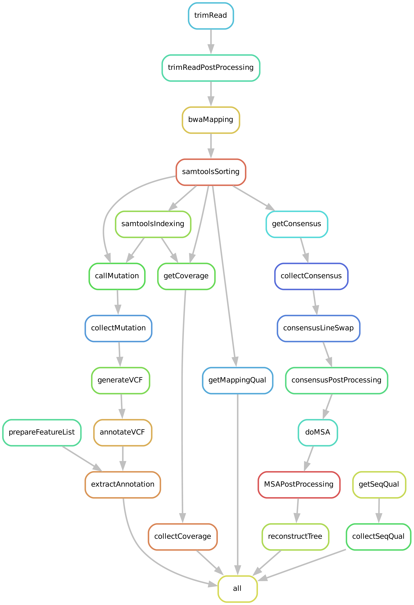

# Sequencing Data Processing Pipeline

All steps for processing raw sequencing reads are implemented using a **Snakemake** workflow.  
The pipeline currently consists of **10 modules** located in the `./module` directory, each responsible for a specific stage of the analysis.

## Pipeline Overview

The directed acyclic graph (DAG) of the workflow is shown below:

---

## Workflow Description

### 0. Configuration
The pipeline is initialized in `0_config.smk`, which:
- Defines working directories
- Automatically detects available samples using wildcard patterns
- Allows optional subsetting of experiments, lines, and samples for targeted runs

---

### 1. Raw Read Quality Control
Quality assessment is performed using:
- **FASTQC** (per-sample reports)
- **MULTIQC** (aggregated reports per experiment and line)

Outputs:
- Individual FASTQC HTML reports
- Combined MULTIQC reports

---

### 2. Read Trimming
Reads are processed with **Trimmomatic** (paired-end mode):
- Leading/trailing base trimming (**quality threshold: 20**)
- Sliding window trimming (**4 bp window, quality ≥ 20**)
- Minimum read length: **36 bp**

Trimmed reads are compressed and stored for downstream analysis.

---

### 3. Read Mapping
Trimmed reads are aligned to the **HIV-1 plasmid consensus reference genome** using **BWA-MEM**.

Processing steps:
- Alignment → BAM conversion
- Sorting of BAM files (**samtools sort**)

---

### 4. Mapping Quality Control
Mapping quality is evaluated using:
- **Qualimap** for alignment statistics
- Custom Python scripts for:
  - Coverage calculation
  - Generation of coverage plots
  - Extraction of per-sample quality metrics

Outputs:
- Coverage plots
- Per-sample quality files
- Aggregated quality table across all samples

---

### 5. Mutation Calling
Variants are identified using a **custom Python script**:
- Input: sorted BAM files
- Reference: HIV-1 plasmid consensus genome

Outputs:
- Per-sample mutation tables (CSV)
- Aggregated mutation tables per experiment

---

### 6. VCF Generation and Annotation
Variant data is converted and annotated:

- **VCF generation** using an R script
- **Annotation** using **SnpEff**

Outputs:
- Compressed VCF files
- Annotated VCF files

---

### 7. Variant Table Preparation
Annotated variants are further processed to generate analysis-ready tables:

- Preparation of genomic feature list
- Extraction of:
  - Amino acid changes
  - Mutation context

Outputs:
- Final annotated variant tables per experiment

---

### 8. Consensus Sequence Reconstruction
Consensus sequences are reconstructed from mapped reads using **samtools consensus**.

Processing includes:
- Sequence extraction and trimming to target genomic region
- Aggregation of all consensus sequences
- Post-processing steps:
  - Sample renaming and ordering
  - Inclusion of reference sequences (plasmid and HXB2)

Outputs:
- Per-sample consensus sequences
- Combined multi-sequence FASTA files

---

### 9. Phylogenetic Tree Inference
Phylogenetic relationships are reconstructed using:

- **MUSCLE** for multiple sequence alignment
- Post-processing of alignment headers
- **IQ-TREE** for maximum likelihood tree inference
  - Model selection (MFP)
  - Bootstrap support (**1000 replicates**)

Outputs:
- Multiple sequence alignment (MSA)
- Phylogenetic tree files

---

### 10. Diversity Calculation
Genetic diversity metrics are computed using an R script:

- Input: annotated variant tables
- Output: diversity statistics per experiment and line

---

## Variant Filtering and Classification

Variants are filtered using:
- **Minor Allele Frequency (MAF) ≥ 0.01**
- **Minimum sequencing depth ≥ 200 reads**

Classification:

| Category   | Frequency Range      |
|------------|--------------------|
| Fixed      | ≥ 0.99             |
| Majority   | ≥ 0.50             |
| Minority   | 0.01 ≤ freq < 0.50 |

---

## Annotation and Reference Data

- Reference genome: **HIV-1 NL4-3 plasmid** (NCBI: AF324493.2)
- Functional annotation via **SnpEff (v5.1)**
- Includes:
  - 9 protein-coding genes
  - 5 non-coding regions

Reversion analysis is performed by comparing consensus sequences to a cross-subtype reference from the Los Alamos HIV Sequence Database.

---

## Summary

This pipeline provides a fully automated and reproducible workflow for:
- Quality control of sequencing data
- Read preprocessing and alignment
- Variant detection and annotation
- Consensus genome reconstruction
- Phylogenetic inference
- Genetic diversity analysis

Its modular structure allows flexible execution and easy extension.
